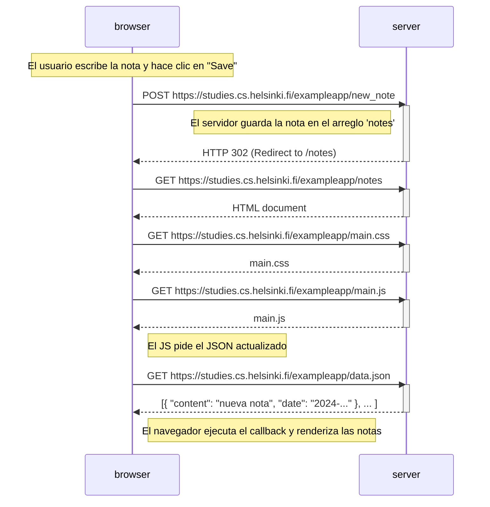
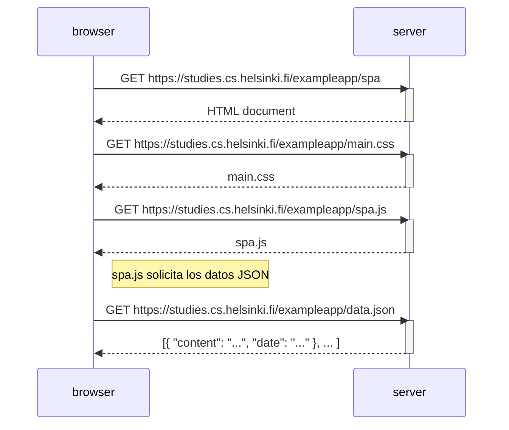
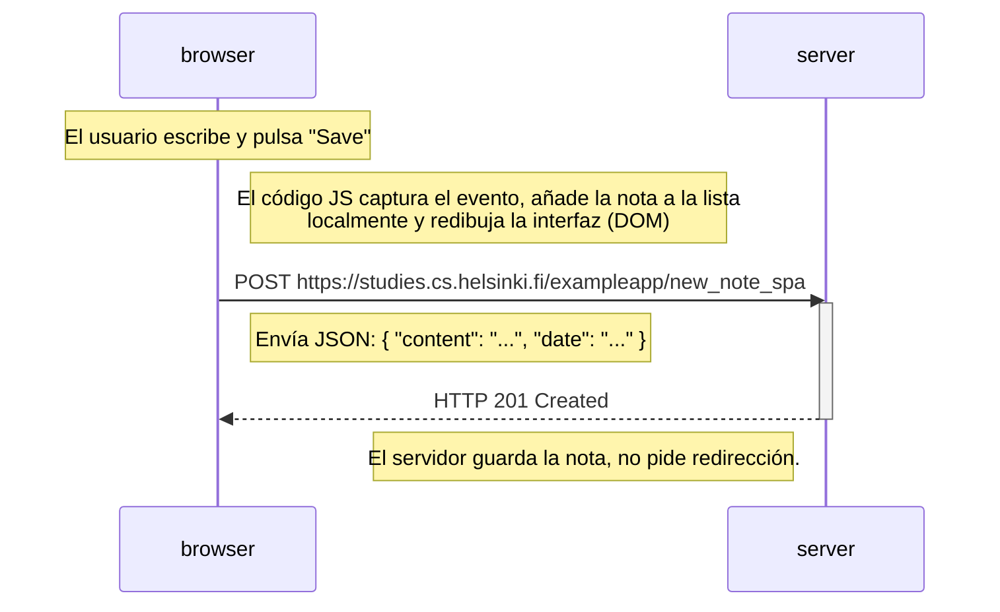

# Ejercicios del apartado con diagramas Mermaid

## 0.4

```mermaid
sequenceDiagram
    participant browser
    participant server

    Note over browser: El usuario escribe la nota y hace clic en "Save"

    browser->>server: POST https://studies.cs.helsinki.fi/exampleapp/new_note
    activate server
    Note left of server: El servidor guarda la nota en el arreglo 'notes'
    server-->>browser: HTTP 302 (Redirect to /notes)
    deactivate server

    browser->>server: GET https://studies.cs.helsinki.fi/exampleapp/notes
    activate server
    server-->>browser: HTML document
    deactivate server

    browser->>server: GET https://studies.cs.helsinki.fi/exampleapp/main.css
    activate server
    server-->>browser: main.css
    deactivate server

    browser->>server: GET https://studies.cs.helsinki.fi/exampleapp/main.js
    activate server
    server-->>browser: main.js
    deactivate server

    Note right of browser: El JS pide el JSON actualizado

    browser->>server: GET https://studies.cs.helsinki.fi/exampleapp/data.json
    activate server
    server-->>browser: [{ "content": "nueva nota", "date": "2024-..." }, ... ]
    deactivate server

    Note right of browser: El navegador ejecuta el callback y renderiza las notas
```

## 0.5

```mermaid
sequenceDiagram
    participant browser
    participant server

    browser->>server: GET https://studies.cs.helsinki.fi/exampleapp/spa
    activate server
    server-->>browser: HTML document
    deactivate server

    browser->>server: GET https://studies.cs.helsinki.fi/exampleapp/main.css
    activate server
    server-->>browser: main.css
    deactivate server

    browser->>server: GET https://studies.cs.helsinki.fi/exampleapp/spa.js
    activate server
    server-->>browser: spa.js
    deactivate server

    Note right of browser: spa.js solicita los datos JSON

    browser->>server: GET https://studies.cs.helsinki.fi/exampleapp/data.json
    activate server
    server-->>browser: [{ "content": "...", "date": "..." }, ... ]
    deactivate server
```

## 0.6

```mermaid
sequenceDiagram
    participant browser
    participant server

    Note over browser: El usuario escribe y pulsa "Save"
    Note right of browser: El código JS captura el evento, añade la nota a la lista <br/>localmente y redibuja la interfaz (DOM)

    browser->>server: POST https://studies.cs.helsinki.fi/exampleapp/new_note_spa
    activate server
    Note right of browser: Envía JSON: { "content": "...", "date": "..." }
    server-->>browser: HTTP 201 Created
    deactivate server

    Note left of server: El servidor guarda la nota, no pide redirección.
```

